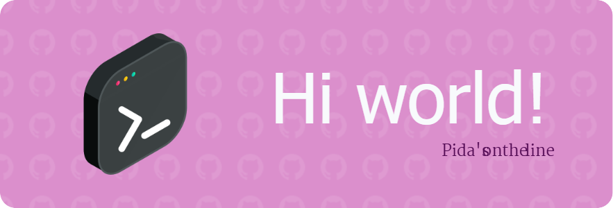

<!--
**pidazlya/pidazlya** is a ✨ _special_ ✨ repository because its `README.md` (this file) appears on your GitHub profile.

Here are some ideas to get you started:

- 🔭 I’m currently working on ...
- 🌱 I’m currently learning ...
- 👯 I’m looking to collaborate on ...
- 🤔 I’m looking for help with ...
- 💬 Ask me about ...
- 📫 How to reach me: ...
- 😄 Pronouns: ...
- ⚡ Fun fact: ...
-->
<h1 align="left">System.out.println("Hello, I’m Pida👩‍💻");</h1>

###

Just a tech enthusiast who loves turning ideas into real things. Currently learning AI, designing stuff, and building cool projects. Let’s create, grow, and have fun along the way 🚀

###

<h4 align="center">I code with</h4>

###

  
  
  
  
  
  
  
  
  
  
  
  
  

###

 

<h4 align="center">🤝 Let’s connect and create something awesome!</h4>

### 🤝 Let’s connect and create something awesome!

  
  
  
  

<picture>
  <source media="(prefers-color-scheme: dark)" srcset="https://raw.githubusercontent.com/pidazlya/pidazlya/output/pacman-contribution-graph-dark.svg">
  <source media="(prefers-color-scheme: light)" srcset="https://raw.githubusercontent.com/pidazlya/pidazlya/output/pacman-contribution-graph.svg">
  
</picture>

###
